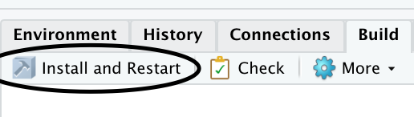
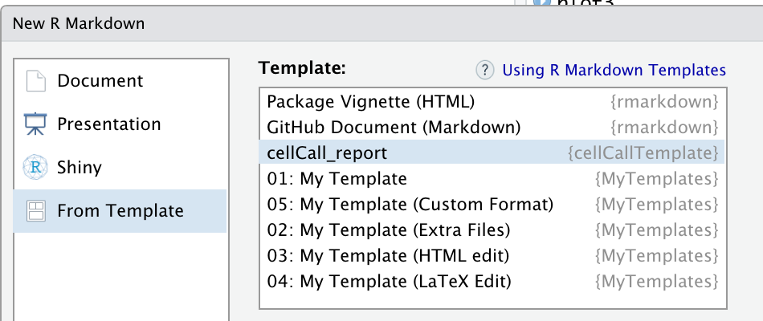

## Overview 
This notebook will give a short introduction and demo on the parameterized reports and interactive plots. Please feel free to contact me if you find anything unclear, or you can read some articles to fully grasp these techniques.  

#### References and articles suggested to read  
- Creating a basic template package in R, *Very recommended to make the template package* <https://chester.rbind.io/ecots2k16/template_pkg/>  
- R Markdown Document Templates: <https://rstudio.github.io/rstudio-extensions/rmarkdown_templates.html#overview>  
- R Markdown Book, chap.17 Document Templates <https://bookdown.org/yihui/rmarkdown/document-templates.html>  
- Plotly Book, *Interactive web-based data visualization with R, plotly, and shiny* <https://plotly-r.com/index.html>  
- Plotly graphic library <https://plotly.com/r/>  
- Plotly Cheatsheet (**Recommended to see the big picture first**) <https://images.plot.ly/plotly-documentation/images/r_cheat_sheet.pdf?_ga=2.245755590.352238882.1592580113-350277872.1592580113>  

### Main functions of parameterized report and interactive plot:  
- Use a **package of Rmd template**: easy to share and use
- can pass a ggplot object generated in pipeline script directly into the R markdown file as a **parameter**  
- can make plotly plot from a ggplot to add interactive features  
  - ggplotly(a_ggplot_object)
  - add **highlighting** features and a **data table** displaying corresponding data side by side
  
## Paramaterized report  
*"Parameters are useful when you want to re-render the same report with **distinct values for various key inputs**, for example:*  
- *Running a report specific to a department or geographic region.*  
- *Running a report that covers a specific period in time.*  
- *Running multiple versions of a report for distinct sets of core assumptions. "*  
Reference from *Parameterized Reports* <https://rmarkdown.rstudio.com/developer_parameterized_reports.html%23parameter_types%2F>
  
## Potential issues/downsides:  
- In terms of **ggplot**, it converys a user's own perspective on how to plot and show information in a certain way based the understanding towards the dataset and questions to be solved, so it's very **customized** by the user  
  - The only default can be set is using ggplotly() wrapper on a ggplot  
  - More fancy interactive features need to be developed by your own  
  - Why not ggplotly? Maybe too many scatterpoints in the plot(a plethora of cells) --> slow , or the original feature is adequate  
  
```{r setup, include=FALSE}
library(ggplot2)
library(plotly)
knitr::opts_chunk$set(echo = TRUE)
```

### 1. Make a R Markdown template in a package
One significant thing needed to be mentioned first:
You can easily follow the first reference to make your own Rmd template package but just in the final step where you've finished coding the template. You need to click on the Build button beside Environment and History in the upp right corner and click on "Install and restart"  
```{r, out.width = "400px", echo=F}

```

then you will see the template:  
```{r, out.width = "400px", echo=F}

```

### A quick intro  
You can customize your own template package in this way:  
This function generates the directory structure needed for a package of Rmd template.  
In short, a new dir is made: **inst/rmarkdown/templates/my_template**, where **template.yaml** is located, which you can make your own customization of the first few lines in any Rmd file, less important for basic development.
In the subfolder **skeleton**, there is the skeleton.Rmd template file that you need to customize things, moreover, you can also put the graphics(.png), .css file, etc in this folder for access in the skeleton.Rmd

```{r, eval=FALSE}
library(usethis)
use_rmarkdown_template(
  template_name = "my_template",
  template_dir = NULL,
  template_description = "A description of the template",
  template_create_dir = FALSE
)
```

## Examples:  
### 1. pass plots as parameters  
The code below should be in an R script, the files auto_rmd_test.R is enclosed in the repository  
```{r eval=FALSE}

plot1 <- ggplot(data = iris) +
  geom_point(mapping = aes(x = Sepal.Length, y = Sepal.Width))

plot2 <- ggplot(data = iris) +
  geom_point(mapping = aes(x = Sepal.Length, y = Sepal.Width, color = Species))

plot3 <- ggplot(data = iris) +
  geom_bar(mapping = aes(x = Species, fill = Species))

rmarkdown::render(input = "test_params.Rmd",
                  output_file = "test.html",
                  params = list(plot1 = plot1,
                                plot2 = plot2,
                                plot3 = plot3))


```
First plot:

```{r eval=FALSE}
p1 <- params$plot1
ggplotly(p1)


```

Second plot:

```{r eval=FALSE}
p2 <- params$plot2
ggplotly(p1)
```

Third plot:

```{r eval=FALSE}
p3 <- params$plot3
ggplotly(p1)
```

### 2. Pass a string of Species that will be used to filter the lines  

```{r}
library(DT)
DT::datatable(iris)
```

```{r eval=FALSE}

species <- c("setosa", "versicolor", "virginica")
sapply(species, function(x) {
  rmarkdown::render(input = "iris_params_early.Rmd",
                    output_file = sprintf("iris_params_%s.html", x),
                    params = list(species = x))
})
```

Then in the template iris_params_early.Rmd, code this:  
```{r eval=FALSE}
species <- params$species
summary(iris[iris$Species == species, ])# use the parameter to filter out the certain lines corresponding to that Species
```


